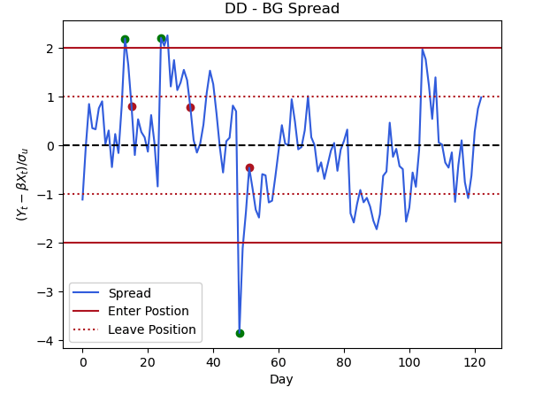

# Pairs Selection with Unsupervised Clustering
The aim of this folder is to select candidate pairs from the S&P500 that can be used for pairs trading. The main bulk of the work is done in the `Pairs_Selection_with_Unsupervised_Learning` notebook. 

## Pairs Selection Notebook
In this notebook we carry out the following steps:
1. **Getting the Data**: We wrote code to take stock time series data from the S&P500 and relevent sector information. We created aggregate time series for each sector into baskets.
2. **Pairs Selection**:
   - By calculating the correlation of each stock with the baskets, we generated features for unsupervised learning.
   - Using 4 different clustering methods (K-means, Hierarchical, DBSCAN, GMM), we generated different clusters of pairs. Three methods worked well, however we ignore the results of DBSCAN due to poor convergence. 
3. **Generate Pairs**: From each of the clusters across all the methods, we generated candidate pairs. We only kept those pairs that 
were common to all the algorithms. This gave 9,500 pairs.
4. **Cointegration Test**: We performed the Engle-Granger test to check if the spread of the pair was stationary. We kept those that 
were significant at the 1% level. This gave ~570 pairs.
5. **Examining the Pairs**:
    - We look at which sectors were over/underrepresented. We found that we were only using 350 stocks (about 3/4 the number we were expecting), however that no on sector was over/under represented.
    - When looking at the sector pairing, we found that no one sector pairing was particularly strong, however the difference was really driven by the absolute number in each sector. 

## Pairs Trading Prototype Notebook
In this notebook we take a few example pairs, fit the linear relationship between the two stocks and impliment a pairs trading alogrithm. We then fit the linear relationship between all the pairs, and save to file. An example of the spread between two stock is shown below. The green (red) dots show when we enter (leave) a position.

## Results 
We back test our strategy with all the pairs that were found in the clustering notebook. We take SP500 data from July 2023-Jan 
2024 (we fit on the six month period before this). On our test sample we achieve:
- **Sharpe Ratio:** 2.04.
- **Annual Returns:** 6.21%.
- **Annual Volatility:** 1.33%.

We enter our position when the spread is over 2 sigma from the mean and we exit the position when we are 1 sigma from the 
mean.  

For the specific implimentation of the strategy and the code that carries out the backtesting, please find it at https://github.com/DomincDootson/BackTesting. 
